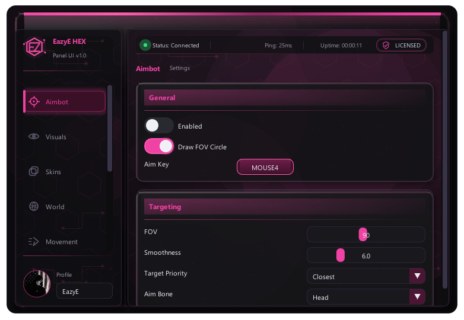
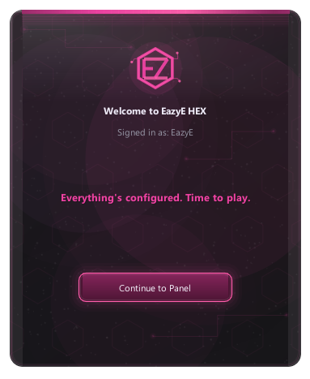
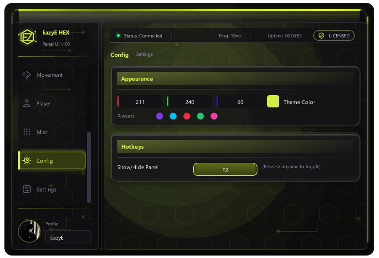
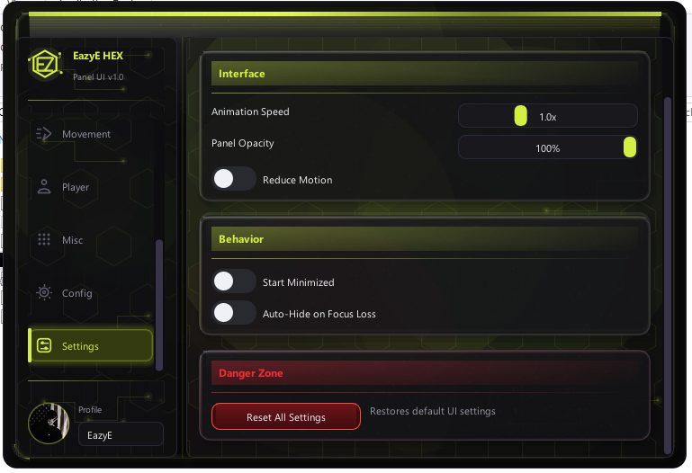

# EazyE HEX — Gaming Overlay Panel UI Mockup

> ⚠️ Disclaimer: This project is a pure UI/UX mockup built purely for educational purposes — to practice C++, Dear ImGui, DirectX 11, and modern software engineering/vibe-coding workflows. It contains NO real game-hacking functionality: no memory reading, no process injection, no game hooking, no network manipulation, and no ability to interact with any external application or process whatsoever. Every toggle, slider, and button in this panel only affects local, in-memory UI state or a local JSON config file. This project does NOT provide any competitive advantage in any game and cannot be used to cheat. It exists solely as a learning exercise and portfolio piece demonstrating UI/UX design and C++ application development skills.

## What This Project Is

EazyE HEX is a Windows desktop UI mockup built while learning C++ through an AI-assisted "vibe coding" workflow: detailed feature specifications were translated into implementation work with the help of an AI coding agent. The project focuses on practicing immediate-mode GUI development, DirectX 11 rendering, Win32 API window management, JSON serialization, multithreading concepts, and UI/UX design principles inspired by the visual language of modern gaming overlay software.

The result is a polished, interactive panel that behaves like a complete product interface while remaining strictly local and non-functional outside its own mock UI state.

## Features

- Sidebar navigation across eight panel categories: Aimbot, Visuals, Skins, World, Movement, Player, Misc, and Config/Settings.
- Dynamic live theme color system with RGB controls, preset swatches, and smooth accent-color transitions.
- JSON-based automatic configuration persistence with silent auto-save and startup auto-load.
- Custom profile picture upload using a local file picker and DirectX texture loading.
- Animated splash screen and welcome screen with polished transitions.
- Frosted-glass/acrylic panel styling with layered depth, grain, edge highlights, and translucent cards.
- Animated hexagon and circuit-style background patterns.
- Animated glowing border trace around the main panel.
- Glitch-style EazyE HEX logo and title treatment with synced RGB channel-split bursts.
- Toast notification system for important UI feedback.
- Live status bar with uptime, mock ping, and session-style indicators.
- Customizable global hotkey for showing and hiding the panel.
- Live ESP/Chams color preview widget for UI color experimentation.
- Smooth micro-interactions, including ripple effects, hover scale/glow, section-card lift, easing curves, and press feedback.
- Settings tab with animation speed, panel opacity, reduce-motion, start-minimized preference, auto-hide-on-focus-loss, and reset confirmation flow.
- Embedded custom Windows application icon.

## Tech Stack

- C++17
- Dear ImGui
- DirectX 11
- Win32 API
- CMake
- MinGW-w64
- nlohmann/json
- stb_image

## Screenshots






## Build Instructions

These steps match the current Windows + MinGW-w64 + CMake build workflow used for the project.

### Prerequisites

Install:

- Windows 10 or newer
- CMake 3.20 or newer
- MinGW-w64 with `g++`, `mingw32-make`, and `windres` available on `PATH`
- Git

The project expects a Dear ImGui checkout in one of these locations:

- `imgui-master/`
- `external/imgui/`
- a custom path passed through `-DIMGUI_DIR=...`

If no local ImGui checkout is found, CMake is configured to fetch Dear ImGui with `FetchContent`.

### Configure

```powershell
cmake -S . -B build -G "MinGW Makefiles"
```

### Build

```powershell
cmake --build build
```

The executable is generated at:

```text
build/EazyE_HEX.exe
```

### Optional: Use a Specific Dear ImGui Checkout

```powershell
cmake -S . -B build -G "MinGW Makefiles" -DIMGUI_DIR="C:\path\to\imgui"
cmake --build build
```

### Notes

- Runtime config files are written locally under `configs/` and are ignored by Git.
- Build outputs such as `build/`, object files, static libraries, DLLs, and executables are ignored by Git.
- The Windows app icon is embedded through `src/app.rc` using MinGW `windres`.

## Project Structure

```text
.
├── assets/
│   └── icon.ico
├── src/
│   ├── app.rc
│   ├── ConfigManager.cpp
│   ├── ConfigManager.h
│   ├── ImageLoader.cpp
│   ├── ImageLoader.h
│   ├── main.cpp
│   ├── PanelUI.cpp
│   ├── PanelUI.h
│   ├── resource.h
│   ├── Theme.cpp
│   └── Theme.h
├── third_party/
│   ├── json/
│   └── stb/
├── CMakeLists.txt
├── LICENSE
└── README.md
```

## Learning Journey

EazyE HEX was built incrementally over multiple sessions as a hands-on C++ and Dear ImGui learning project. Each feature was specified, implemented, tested, refined, and polished step by step with the help of an AI coding assistant. The project reflects a practical learning process: improving UI composition, animation timing, state management, build tooling, resource embedding, and Windows application behavior while keeping the scope strictly educational and mock-only.

## License

This project is licensed under the MIT License. See [LICENSE](LICENSE) for details.

## Author

- Name: Mohammed Ghandour
- GitHub: [https://github.com/your-username](https://github.com/mohammedghandour2004-glitch)
- LinkedIn: www.linkedin.com/in/mohammed-ghandour-auto
